# Nodemailer Authentication System (Node.js + Express + MongoDB)

This project is a complete authentication and user-management app built with Node.js, Express, MongoDB (Mongoose), Handlebars, and Nodemailer.

It includes both user and admin panels with email verification, forgot-password flow, session-based auth, and export features (Excel/PDF).

## Features

### User Features

- User registration
- Login and logout
- Email verification link
- Forgot password and reset password via email token
- Profile edit

### Admin Features

- Admin login and logout
- Forgot password and reset password
- User dashboard with search and pagination
- Add new user
- Edit user
- Delete user
- Verify/Unverify user
- Export users to Excel
- Export users to PDF

### Other Features

- Session-based authentication (`express-session`)
- Password hashing with `bcrypt`
- Server-rendered UI using Handlebars (`hbs`)

## Tech Stack

- Node.js
- Express.js
- MongoDB + Mongoose
- Nodemailer
- Handlebars (`hbs`)
- ExcelJS
- html-pdf

## Project Structure

```text
Nodemailer/
|- index.js
|- package.json
|- config/
|  |- config.js
|- controllers/
|  |- userController.js
|  |- adminController.js
|- db/
|  |- conn.js
|- middleware/
|  |- auth.js
|  |- adminAuth.js
|- models/
|  |- profileModel.js
|- routes/
|  |- userRoute.js
|  |- adminRoute.js
|- views/
|  |- admin/
|  |- users/
|  |- partials/
|- public/
```

## Installation

1. Clone the repository

```bash
git clone https://github.com/Vivek635229/NodeEmail-Auth-System.git
cd Nodemailer
```

2. Install dependencies

```bash
npm install
```

3. Create `.env` file in project root

```env
PORT=1000
SSECRECT=your_session_secret
USEREMAIL=your_email@gmail.com
USERPASS=your_email_app_password
APP_BASE_URL=http://127.0.0.1:1000
```

4. Start MongoDB locally

Make sure MongoDB is running on:

```text
mongodb://127.0.0.1:27017/Nodemailer
```

Note: Database URL is currently hardcoded in `db/conn.js`.

5. Run project

```bash
npm run dev
```

For production mode:

```bash
npm start
```

## Default URLs

- User login: `http://127.0.0.1:1000/`
- User register: `http://127.0.0.1:1000/register`
- Admin login: `http://127.0.0.1:1000/admin`
- Admin dashboard: `http://127.0.0.1:1000/admin/dashboard`

## Screenshots

### Login Page

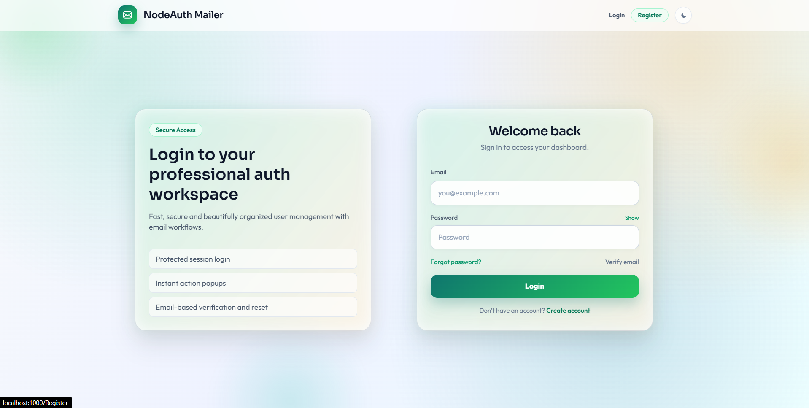

### Registration Page

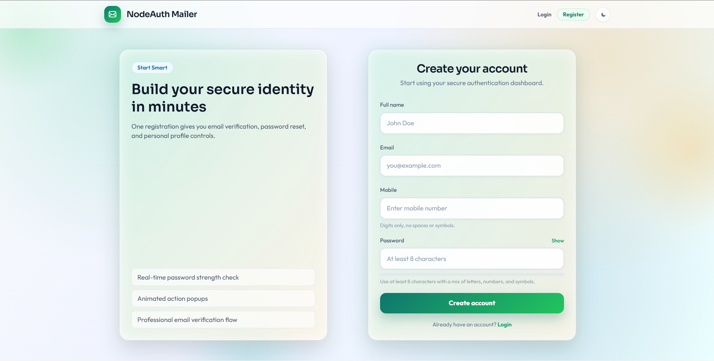

### User Dashboard

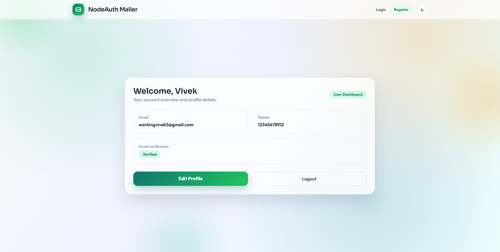

### User Edit Profile

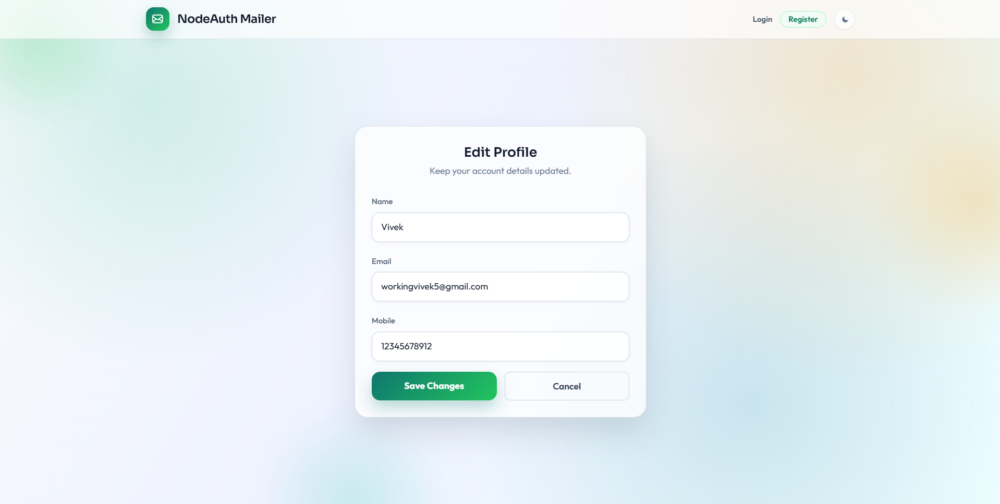

### Admin Login

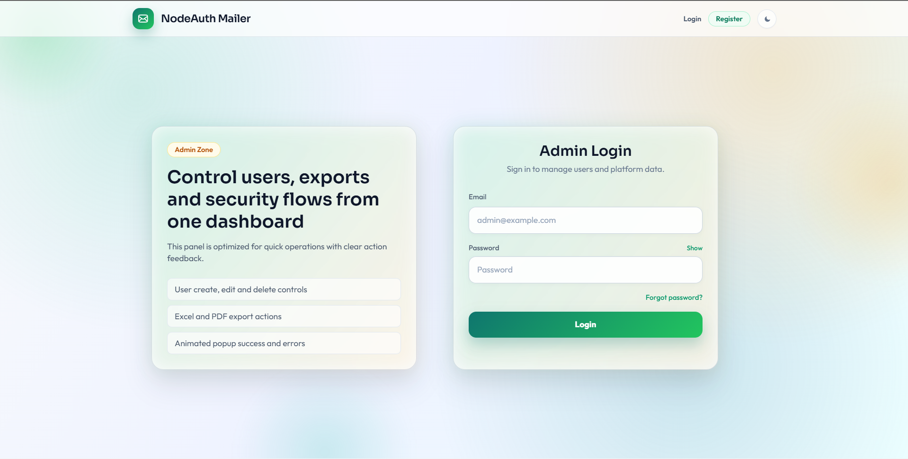

### Admin Dashboard

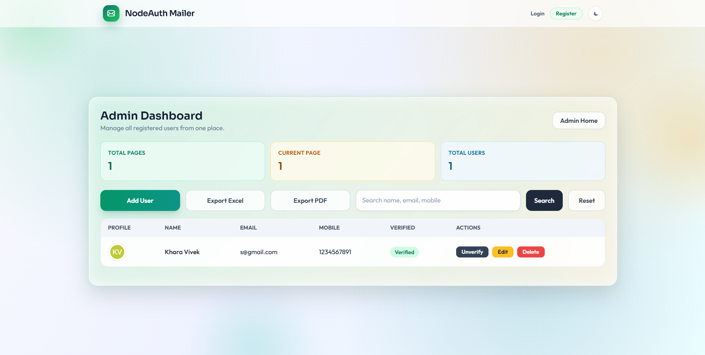

### Edit User From Admin

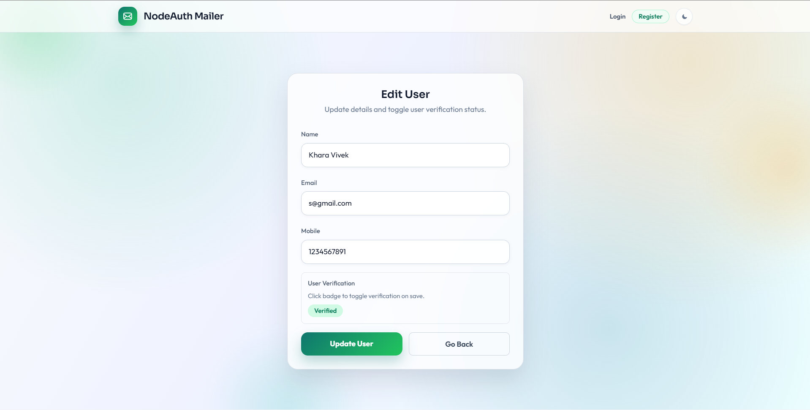

### Forgot Password

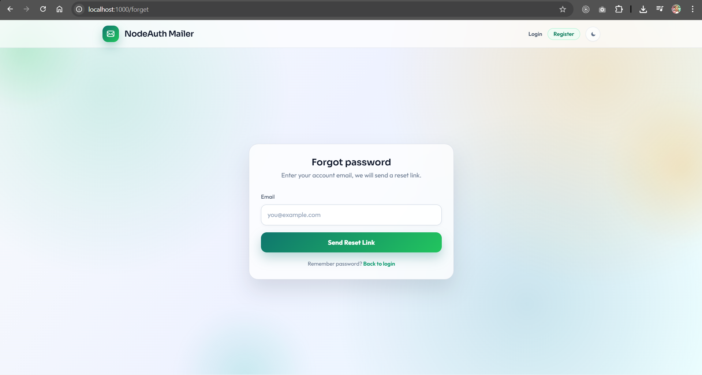

### Email Verification Page

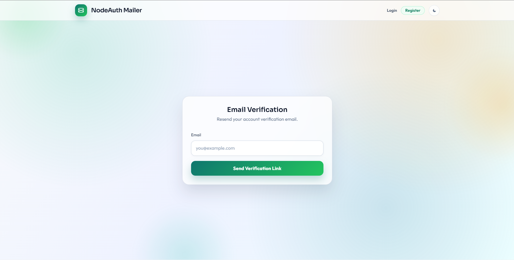

### Email Verified Message

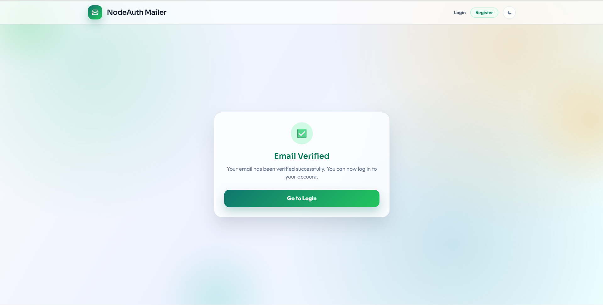

### Verification Email Link (Inbox)

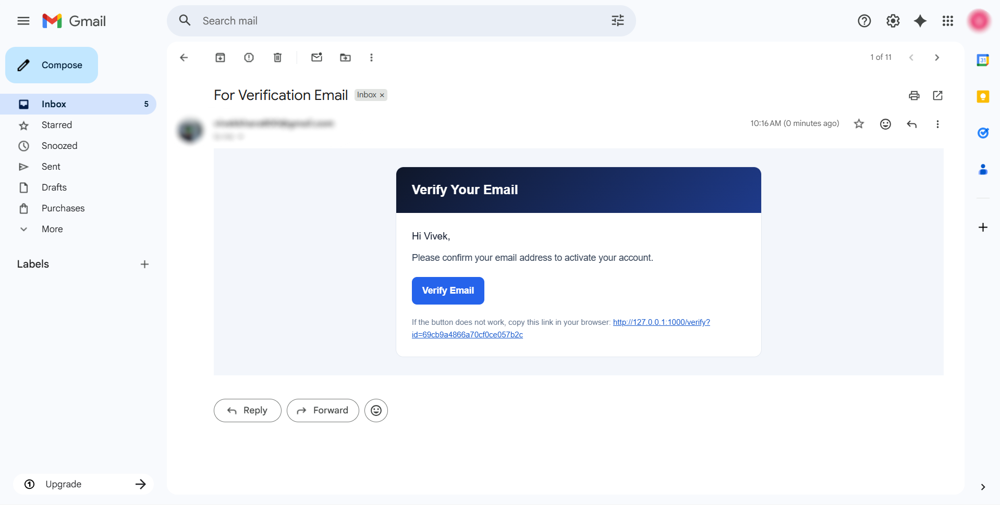

## Project Reports

- PDF Report: [users.pdf](docs/report/users.pdf)
- Excel Report: [users.xlsx](docs/report/users.xlsx)

## Documentation Path Convention

For future uploads, keep files in these folders:

- Screenshots folder: `docs/screenshots/`
- Report folder: `docs/report/`

Recommended naming:

- Screenshots: `NN-page-name.png` (example: `01-login-page.png`)
- Report: `Project-Report.pdf`

## Important Notes

- There is no automatic admin seed.
- To create admin account, update a user in MongoDB with:

```json
{
  "is_admin": 1,
  "is_varified": 1
}
```

- For Gmail SMTP, use App Password (normal Gmail password usually will not work).

## Scripts

From `package.json`:

- `npm run dev` -> Start with nodemon
- `npm start` -> Start with node

## Author

Vivek Khara

## License

ISC
